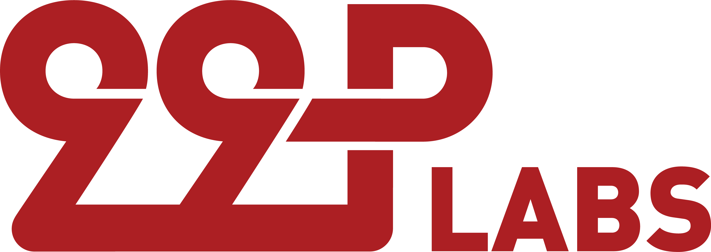

# PlantD Operator

[](https://goreportcard.com/report/github.com/CarnegieMellon-PlantD/PlantD-operator)
[](https://github.com/CarnegieMellon-PlantD/PlantD-operator/actions/workflows/release-ghcr.yaml)


Kubernetes operator for PlantD.

## Documentation

For how to install PlantD, see [installation guide](https://plantd.org/docs/tutorial/installation/).

For more information about PlantD, see [PlantD website](https://plantd.org).

## Development

### Prerequisites

- [Go](https://golang.org/) (`>= 1.21`)
- [kubebuilder](https://book.kubebuilder.io/quick-start.html#installation)
- [kubectl](https://kubernetes.io/docs/tasks/tools/install-kubectl/)
- [Prometheus Operator](https://github.com/prometheus-operator/prometheus-operator)
- [K6 Operator](https://github.com/grafana/k6-operator)

To install the Prometheus Operator and K6 Operator, run the following commands:

```shell
# Install the K6 Operator
curl https://raw.githubusercontent.com/grafana/k6-operator/main/bundle.yaml | kubectl create -f -

# Install the Prometheus Operator
curl https://raw.githubusercontent.com/prometheus-operator/prometheus-operator/main/bundle.yaml | kubectl create -f -
```

### CLI Commands

#### Generate code

```shell
make generate
```

This command will generate the auto-generated code such as `zz_generated.deepcopy.go`.

**NOTE**: Remember to run this command after modifying the CRD.

#### Generate CRD manifests

```shell
make manifests
```

This command will generate the CRD manifests under `config`.

**NOTE**: Remember to run this command after modifying the CRD.

#### Generate `bundle.yaml`

```shell
make bundle
```

This command will generate the `bundle.yaml`.

**NOTE**: Remember to run this command after modifying the CRD.

#### Generate CRD API reference

```shell
make docs
```

This command will generate the CRD API reference at [`docs/api/crd-api-reference.md`](docs/api/crd-api-reference.md).

**NOTE**: Remember to run this command after modifying the CRD.

#### Install/Uninstall the CRD

```shell
# Install
make install

# Uninstall
make uninstall
```

#### Deploy/Undeploy the operator

```shell
# Deploy
make deploy

# Deploy with a custom Docker image
make deploy IMG=<custom-image>

# Undeploy
make undeploy
```

**NOTE**: Remember to run

```shell
kubectl delete plantdcore -n plantd-operator-system plantdcore-core
```

before undeploying the operator, since the undeploying command will remove PlantD controllers before removing the `PlantDCore` resource, and the `PlantDCore` resource has a finalizer that will prevent the entire process from completing given the operator is removed before.

### Release

This project uses GitHub Actions as our CI/CD pipeline and to release Docker images to GitHub Container Registry. See [`.github/workflows/release-ghcr.yaml`](.github/workflows/release-ghcr.yaml) for more details.

To release a new version, create a new git tag with the version number prefixed with `v`, e.g., `v1.2.3`. See [semantic versioning](https://semver.org/) for more details about version numbers. Then, push the git tag and the workflow will be triggered automatically. The output Docker image will be tagged with the same version number as the git tag.

You can also manually trigger the workflow to release an unversioned Docker image with a tag of the git commit hash. To do so, go to the [workflow page](https://github.com/CarnegieMellon-PlantD/PlantD-operator/actions/workflows/release-ghcr.yaml).

### References

- [Kubebuilder Book](https://book.kubebuilder.io/)

## Contributing

We welcome contributions from the open-source community, from bug fixes to new features and improvements. See [CONTRIBUTING.md](CONTRIBUTING.md) for more information on how to contribute.

## License

PlantD is licensed under the GPLv2 License. See [LICENSE](LICENSE) for more details.

## Funding

PlantD is funded by Honda's 99P labs, with implementation and ongoing support provided by the TEEL team at Carnegie Mellon University.

## Contact

[](https://developer.99plabs.io/home/)
[](https://teel.cs.cmu.edu)
[](https://www.cmu.edu)

For more information about the PlantD project, please contact us:

- Honda 99P labs: support@99plabs.com
- TEEL Labs: teel@andrew.cmu.edu

We are always open to collaboration, questions, and suggestions!
